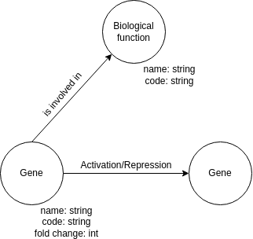

# Projeto `Ciência de Redes aplicada a Epilepsia`
# Project `Network Science applied to Epilepsy`

# Descrição Resumida do Projeto

A presente proposta de estudo aplica métodos de ciência de redes na análise de genes diferencialmente expressos em pacientes com histórico de epilepsia e diagnóstico de Displasia Cortical Focal (DCF) do tipo 2b. Utilizando técnicas estatísticas, visamos identificar genes com expressão diferencial e construir redes de interações para visualizar relações e funções biológicas. Nessas redes, utilizaremos as seguintes técnicas de ciência de redes: análise de enriquecimento funcional, análise de centralidade, detecção de comunidades e, por último, análise de perturbação e robustez. As análises, utilizando essas técnicas, permitirão explorar genes com papéis importantes na rede, a identificação de possíveis módulos desregulados e vulnerabilidades.

# Fundamentação Teórica

A Epilepsia é uma doença causada pela atividade síncrona, excessiva ou anormal das células neuronais no cérebro [1]. O relatório oficial [2] da Liga Internacional Contra a Epilepsia (ILAE) de 2014 define esta doença através de qualquer uma das seguintes opções:

1. Pelo menos duas crises não provocadas (ou reflexas) ocorrendo com intervalo de 24 horas;
2. Uma convulsão não provocada (ou reflexa) e uma probabilidade de novas convulsões semelhante ao risco de recorrência geral (pelo menos 60%) após duas convulsões não provocadas, ocorrendo durante os próximos 10 anos;
3. Diagnóstico de uma síndrome epiléptica.

De acordo com a Organização Mundial de Saúde (OMS) [3], mais de 50 milhões de pessoas em todo o mundo têm epilepsia. No cenário brasileiro ela representa aproximadamente 2% da população.

A sua etiologia é diversa, podendo estar associada a causas genéticas, infecciosas, metabólicas, estruturais, imunológicas e desconhecidas [1]. Entretanto, a maior parte das cirurgias de epilepsia em crianças [4] é devido a uma Malformação do Desenvolvimento Cortical (MDC) denominada de Displasia Cortical Focal (DCF).

A DCF é caracterizada por lesões com anormalidades estruturais e celulares do córtex cerebral, tais como deslaminação das camadas corticais, i.e. perda da distinção entre as seis camadas celulares encontradas em córtices normais, e anormalidades no desenvolvimento celular. Os indivíduos com essa malformação geralmente não respondem ao tratamento com os medicamentos anticonvulsivantes disponíveis, sendo frequentemente submetidos a resecção cirúrgica da área afetada [4].

As DCFs são classificadas em três categorias, cada uma com sua histopatologia e alterações genéticas distintas [5]. Entre elas, a DCF II é o tipo mais comum e se distingue de outros tipos de DCFs devido à presença de tipos celulares anômalos, além da deslaminação cortical. No nível histopatológico, a DCF tipo II pode ser ainda subdividida em DCF IIa e IIb, apresentando neurônios dismórficos apenas (IIa) ou com ambos neurônios dismórficos e células balão (IIb), entidades celulares com um número elevado de mutações quando comparadas ao resto do tecido [6]. Neurônios dismórficos têm corpos celulares e núcleos significativamente aumentados, enquanto células em balão possuem um grande corpo celular com citoplasma vítreo, opalescente e eosinofílico; também podem ser multinucleadas [7]. 

Pacientes com DCF II geralmente apresentam hiperativação da via de sinalização mTOR (mammalian Target Of Rapamycin), de modo que essa e outras malformações são frequentemente denominadas mTORpatias [4]. Essa via de sinalização está envolvida no crescimento e proliferação celular, além da autofagia [8]. É fundamental destacar que tais mutações podem ser extremamente raras, tornando o sequenciamento profundo uma ferramenta indispensável. 

Além disso, mesmo em pacientes sem diagnóstico genético conclusivo, i.e., sem mutações nos genes envolvidos nessa via, pode-se observar sinais de hiperativação da via mTOR (a imunorreatividade da proteína p-S6, proteína fosforilada no final da via, é frequentemente utilizada como indicador de ativação). Portanto, é essencial investigar outros genes associados a doença. Ademais, os elementos regulatórios podem desempenhar um papel significativo, uma vez que foram identificados microRNAs com expressão significativamente alterada em amostras displásicas em comparação com controles saudáveis [6].

Dessa forma, este estudo busca construir redes regulatórias e funcionais a partir de  genes diferencialmente expressos (i.e. significativamente mais/menos expressos em diferentes condições) entre indivíduos com DCF do tipo IIb e controles de autópsia com idades e áreas corticais correspondentes, a partir de dados transcriptômicos publicamente disponíveis [9].

# Perguntas de Pesquisa

1. Quais são os genes diferencialmente expressos entre doença e controles?
2. Quais funções biológicas estão mais representadas na doença? (→redes funcionais)
3. Como esses genes estão sendo regulados? (→redes de regulação)

# Bases de Dados

Base de Dados | Endereço na Web | Resumo descritivo
----- | ----- | -----
Transcriptomes distinguish human FCD subtypes | https://www.ncbi.nlm.nih.gov/geo/query/acc.cgi?acc=GSE128300 | 	Metilomas e transcriptomas do DNA gerados a partir de sequenciamento paralelo maciço em 15 espécimes cirúrgicos de DCF, combinados com 5 controles de epilepsia e 8 controles de não epilepsia.
Gene Ontology | https://geneontology.org/ | Maior fonte de informações do mundo sobre as funções dos genes. 

> 

# Metodologia
Para analisar a expressão gênica diferencial, utilizaremos métodos estatísticos do DESeq2. Esta ferramenta permite modelar a contagem de leituras usando uma distribuição negativa binomial e realiza testes de hipótese para determinar genes com expressão significativamente diferente entre as condições.

Com os genes diferencialmente expressos identificados, criaremos uma rede de interações. Esta rede permitirá visualizar e analisar as relações entre os genes, bem como suas funções biológicas associadas. Ao integrar a rede com informações de anotação funcional, como a *Gene Ontology*, será possível relacionar os genes com as suas respectivas funções biológicas e vias de sinalização que estão envolvidas, resultando em uma **análise de enriquencimento funcional**.

Utilizando técnicas de ciência de dados, será possível explorar ainda mais a organização e a dinâmica dos genes na rede. A **análise de centralidade** possibilitará a identificação de genes centrais (“hubs”) que desempenham papéis importantes no funcionamento da epilepsia, sendo potenciais alvos para tratamento. A **detecção de comunidades** revelará grupos de genes que interagem entre si de forma mais intensa que com outros, identificando módulos desregulados que podem estar associados à epilepsia e fornecendo informações sobre as funções biológicas destes módulos.

Além disso, a **análise de perturbação** e robustez permitirá avaliar como a remoção ou perturbação de genes específicos afeta a estrutura e função da rede. Isso ajudará na identificação de vulnerabilidades na rede de genes da epilepsia, apontando genes ou interações críticas para a estabilidade e funcionamento da rede.

# Ferramentas

Neste trabalho, utilizaremos as seguintes ferramentas:
1. **Testes de expressão diferencial (DESeq2)**, para obtenção de genes diferencialmente expressos entre a doença e controles;
2. **Cytoscape**, para geração de rede de genes diferencialmente expressos e da rede de funções biológicas. Também será utilizado para análises utilizando técnicas de ciência de redes.

# Referências Bibliográficas

[1]. Fisher S. Robert, et al. ILAE Official Report: A practical clinical definition of epilepsy. Epilepsia. 14 janeiro de 2014; doi: 10.1111/epi.12550. 

[2]. World Health Organization. Epilepsy. Disponível em: https://www.who.int/health-topics/epilepsy#tab=tab_1. Acesso em: abril de 2024. 

[3]. Patel P, Moshé SL. The evolution of the concepts of seizures and epilepsy: What's in a name? Epilepsia Open. 2020 Jan 10;5(1):22-35. doi: 10.1002/epi4.12375. PMID: 32140641; PMCID: PMC7049807.

[4].	Najm I, Lal D, Alonso Vanegas M, Cendes F, Lopes-Cendes I, Palmini A, et al. The ILAE consensus classification of focal cortical dysplasia: An update proposed by an ad hoc task force of the ILAE diagnostic methods commission. Epilepsia. 2022;63(8):1899–919.

[5].	Lee WS, Baldassari S, Stephenson SEM, Lockhart PJ, Baulac S, Leventer RJ. Cortical Dysplasia and the mTOR Pathway: How the Study of Human Brain Tissue Has Led to Insights into Epileptogenesis. Int J Mol Sci. 25 de janeiro de 2022;23(3):1344.

[6].	Blümcke I, Thom M, Aronica E, Armstrong DD, Vinters HV, Palmini A, et al. The clinicopathologic spectrum of focal cortical dysplasias: A consensus classification proposed by an ad hoc Task Force of the ILAE Diagnostic Methods Commission. Epilepsia. janeiro de 2011;52(1):158–74.

[7].	Lim JS, Kim W il, Kang HC, Kim SH, Park AH, Park EK, et al. Brain somatic mutations in MTOR cause focal cortical dysplasia type II leading to intractable epilepsy. Nat Med. abril de 2015;21(4):395–400.

[8].	Liu GY, Sabatini DM. mTOR at the nexus of nutrition, growth, ageing and disease. Nat Rev Mol Cell Biol. abril de 2020;21(4):183–203.

[9].	Kobow K, Ziemann M, Kaipananickal H, Khurana I, Mühlebner A, Feucht M, et al. Genomic DNA methylation distinguishes subtypes of human focal cortical dysplasia. Epilepsia. 2019;60(6):1091–103.
