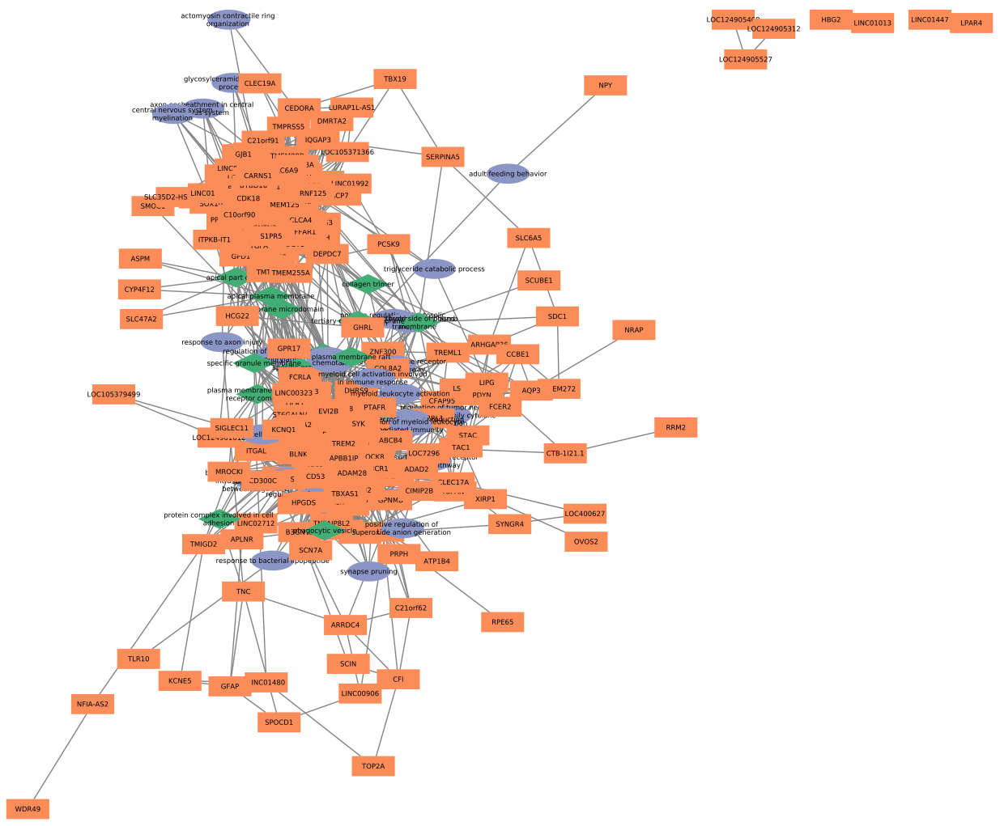

# Projeto Ciência de Redes aplicada a Epilepsia
# Project Network Science applied to Epilepsy

# Descrição Resumida do Projeto

A presente proposta de estudo aplica métodos de ciência de redes na análise de genes diferencialmente expressos em pacientes com histórico de epilepsia e diagnóstico de Displasia Cortical Focal (DCF) do tipo 2b. Utilizando técnicas estatísticas, visamos identificar genes com expressão diferencial e construir redes de interações para visualizar relações e funções biológicas. Nessas redes, utilizaremos as seguintes técnicas de ciência de redes: análise de enriquecimento funcional, análise de centralidade, detecção de comunidades e, por último, análise de perturbação e robustez. As análises, utilizando essas técnicas, permitirão explorar genes com papéis importantes na rede, a identificação de possíveis módulos desregulados e vulnerabilidades.

# Slides

[Slides da apresentação do projeto 3](assets/slides/slides-pt3.pdf)

# Fundamentação Teórica

A Epilepsia é uma doença causada pela atividade síncrona, excessiva ou anormal das células neuronais no cérebro [1]. O relatório oficial [2] da Liga Internacional Contra a Epilepsia (ILAE) de 2014 define esta doença através de qualquer uma das seguintes opções:

1. Pelo menos duas crises não provocadas (ou reflexas) ocorrendo com intervalo de 24 horas;
2. Uma convulsão não provocada (ou reflexa) e uma probabilidade de novas convulsões semelhante ao risco de recorrência geral (pelo menos 60%) após duas convulsões não provocadas, ocorrendo durante os próximos 10 anos;
3. Diagnóstico de uma síndrome epiléptica.

De acordo com a Organização Mundial de Saúde (OMS) [3], mais de 50 milhões de pessoas em todo o mundo têm epilepsia. No cenário brasileiro ela representa aproximadamente 2% da população.

A sua etiologia é diversa, podendo estar associada a causas genéticas, infecciosas, metabólicas, estruturais, imunológicas e desconhecidas [1]. Entretanto, a maior parte das cirurgias de epilepsia em crianças [4] é devido a uma Malformação do Desenvolvimento Cortical (MDC) denominada de Displasia Cortical Focal (DCF).

A DCF é caracterizada por lesões com anormalidades estruturais e celulares do córtex cerebral, tais como deslaminação das camadas corticais, i.e. perda da distinção entre as seis camadas celulares encontradas em córtices normais, e anormalidades no desenvolvimento celular. Os indivíduos com essa malformação geralmente não respondem ao tratamento com os medicamentos anticonvulsivantes disponíveis, sendo frequentemente submetidos a resecção cirúrgica da área afetada [4].

As DCFs são classificadas em três categorias, cada uma com sua histopatologia e alterações genéticas distintas [5]. Entre elas, a DCF II é o tipo mais comum e se distingue de outros tipos de DCFs devido à presença de tipos celulares anômalos, além da deslaminação cortical. No nível histopatológico, a DCF tipo II pode ser ainda subdividida em DCF IIa e IIb, apresentando neurônios dismórficos apenas (IIa) ou com ambos neurônios dismórficos e células balão (IIb), entidades celulares com um número elevado de mutações quando comparadas ao resto do tecido [6]. Neurônios dismórficos têm corpos celulares e núcleos significativamente aumentados, enquanto células em balão possuem um grande corpo celular com citoplasma vítreo, opalescente e eosinofílico; também podem ser multinucleadas [7]. 

Pacientes com DCF II geralmente apresentam hiperativação da via de sinalização mTOR (mammalian Target Of Rapamycin), de modo que essa e outras malformações são frequentemente denominadas mTORpatias [4]. Essa via de sinalização está envolvida no crescimento e proliferação celular, além da autofagia [8]. É fundamental destacar que tais mutações podem ser extremamente raras, tornando o sequenciamento profundo uma ferramenta indispensável. 

Além disso, mesmo em pacientes sem diagnóstico genético conclusivo, i.e., sem mutações nos genes envolvidos nessa via, pode-se observar sinais de hiperativação da via mTOR (a imunorreatividade da proteína p-S6, proteína fosforilada no final da via, é frequentemente utilizada como indicador de ativação). Portanto, é essencial investigar outros genes associados a doença. Ademais, os elementos regulatórios podem desempenhar um papel significativo, uma vez que foram identificados microRNAs com expressão significativamente alterada em amostras displásicas em comparação com controles saudáveis [6].

Dessa forma, este estudo busca construir redes regulatórias e funcionais a partir de  genes diferencialmente expressos (i.e. significativamente mais/menos expressos em diferentes condições) entre indivíduos com DCF do tipo IIb e controles de autópsia com idades e áreas corticais correspondentes, a partir de dados transcriptômicos publicamente disponíveis [9].

# Perguntas de Pesquisa

1. Quais são os genes diferencialmente expressos entre doença e controles?
2. Quais funções biológicas estão mais representadas na doença? (→redes funcionais)
3. Como esses genes estão sendo regulados? (→redes de regulação)
4. Quais são os genes mais importantes na rede para DCF IIb e como eles estão relacionados com a mudança na expressão gênica entre os dois grupos

# Metodologia

Para a realização deste trabalho, seguimos o seguinte fluxo:

> 

1. *Get/Tidy Data* (Coleta/Limpeza dos dados): Nessa primeira fase, coletamos os dados da nossa base de dados (*Transcriptomes distinguish human FCD subtypes*) e reorganizamos os metadados. Além disso, também trocamos o atributo ENSEMBL do gene para SYMBOL.  

2. *Calculate Sample Distances/Distance Heatmap* (Calcular as distâncias entre as amostras / Mapa de Calor das Distâncias): Utilizamos funções R para calcular as distâncias entre as amostras (Figura Vulcano Plot) e gerar o *Heatmap* dos genes (Figura Heatmap). 

> 
> 

3. *Run Differential Expression Analysis* (Rodar Análise de Expressão Diferencial): Para analisar a expressão gênica diferencial, utilizamos métodos estatísticos do DESeq2. Esta ferramenta permite modelar a contagem de leituras usando uma distribuição negativa binomial e realiza testes de hipótese para determinar genes com expressão significativamente diferente entre as condições. Assim, conseguimos obter os genes diferencialmente expressos. 

4. *Gene Set Enrichment Analysis/ Function-Gene Network / CellularComponent-Gene Network* (Análise de Enriquecimento dos Genes / Rede Função-Gene / Rede ComponenteCelular-Gene): Com os genes diferencialmente expressos identificados, criamos duas redes de interações intermediárias: Gene -> Funções Biológicas e Gene -> Componente Celular. Para isso utilizamos uma função do R para fazer um teste hipergeométrico que relacionou as funções biológicas e componentes celulares aos genes, através das informações de anotação funcional do *Gene Ontology*, resultando em uma **análise de enriquecimento funcional**. 

5. *Gene-Gene Correlation Network* (Rede de correlação Gene-Gene): Utilizamos a Correlação de Pearson nos genes diferencialmente expressos para criar relações (arestas) entre genes e filtramos as arestas em que a correlação é maior (p \< 0.05 e statistic \> 0.85). Criando uma terceira rede intermediária: Gene -> Gene. 

6. *Final Network* (Rede Final): Integramos as três redes: Gene-FunçãoBiológica; Gene-ComponenteCelular; e, por fim, a rede com todos os esses nós, com uma visão geral das interações. As redes, assim como grande parte das análises, foram todas geradas no Cytoscape.

Utilizando outras técnicas de ciência de redes, exploramos ainda mais a organização e a dinâmica dos genes na rede. A **análise de centralidade** possibilitou a identificação de genes centrais (“hubs”) que desempenham papéis importantes no funcionamento da epilepsia, sendo potenciais alvos para tratamento. A **detecção de comunidades** revelou grupos de genes que interagem entre si de forma mais intensa que com outros, identificando módulos desregulados que podem estar associados à epilepsia e fornecendo informações sobre as funções biológicas destes módulos. Além disso, a **análise de perturbação e robustez** e a **predição de links** também foram realizadas nas redes geradas, mas as informações obtidas nessas análises não foram suficientes para obtermos conclusões biológicas. As análises detalhadas dessas técnicas podem ser vistas na seção de Análises Realizadas e Discussão.

## Bases de Dados

Base de Dados | Endereço na Web | Resumo descritivo
----- | ----- | -----
Transcriptomes distinguish human FCD subtypes | https://www.ncbi.nlm.nih.gov/geo/query/acc.cgi?acc=GSE128300 | 	Transcriptomas gerados a partir de sequenciamento paralelo maciço em 15 espécimes cirúrgicos de DCF, combinados com 5 controles de epilepsia e 8 controles de não epilepsia.
Gene Ontology | https://geneontology.org/ | Maior fonte de informações do mundo sobre as funções dos genes. 

Os dados de RNA-seq estão disponíveis no *Gene Expression Omnibus* (*accession* GSE128300). O projeto incluirá as 5 amostras de displasia cortical focal do tipo IIb coletadas durante cirurgia de epilepsia, bem como 8 amostras controle, coletadas durante autópsia ou de pacientes menores de 25 anos sem histórico de crises (doença não especificada no artigo[9]). 

Foi obtida a matriz de expressão (*raw counts*). Genes com menos de 10 reads em pelo menos 5 das 13 amostras foram removidos. Para o cálculo da matriz de distância/clustering hierárquico e da correlação entre a expressão dos genes, foi usada a transformação VST (*variance stabilizing transformation*). 

## Modelo Lógico
> 

## Integração entre Bases
A integração das bases de dados foi feita utilizando a biblioteca Pandas do Python, em que as informações foram filtradas e organizadas em tabelas de arestas e de nós. Nessa etapa, não houveram dificuldades. 

## Resultados e Análises Realizadas
Como citado na seção de Metodologia, fizemos a geração de redes de genes diferencialmente expressos, de funções biológicas e de componentes celulares. Além disso, fizemos a integração dessas redes, primeiro separadamente (gene-função biológica e gene-componente celular) e depois de forma geral.

As redes geradas estão demonstradas a seguir:
### Rede de Genes Diferencialmente Expressos
> 

### Rede de Funções Biológicas
> 

### Rede de Componentes Celulares
> 

### Rede Integrada - Gene-Função Biológica
> 

### Rede Integrada - Gene-Componente Celular
> 

### Rede Integrada Geral
> 

Os componentes celulares estão representados por losângulos, os genes por retângulos, e as funções biológicas por elipses:
> 

Abaixo, temos as tabelas com a contagem de nós de cada tipo de nó e aresta nas redes geradas.

> Descrição | Valor
> ----- | -----
> Número de nós do tipo Gene | 236
> Número de nós do tipo Função Biológica | 26
> Número de nós do tipo Componente Ceuluar | 13
> Número de arestas Gene-Gene | 3650
> Número de arestas Gene-Função | 210
> Número de aresta Gene-Componete Celular | 130

Além disso, foram calculadas as médias de grau dos nós de cada tipo de nó, demonstrados na tabela a seguir:

> Descrição | Valor
> ----- | -----
> Média de grau dos nós de tipo Gene | 32.37
> Média de grau dos nós de tipo Função Biológica | 8.08
> Média de grau dos nós de tipo Componente Celular | 10.00

Utilizando o Cytoscape, foram gerados gráficos da distribuição de graus de cada uma das redes:

> 

Nos gráficos, é possível notar que há mais nós com graus entre 0 e 10, porém há também uma quantidade significativa de nós com grau maior que 40. Adicionar os componentes celulares e funções biológicas nas redes aumentou os graus de forma geral, porém houve um aumento maior nos nós de graus baixos, o que é esperado, já que esses nós tem relações apenas genes. 

A partir destas redes, as análises feitas nesse trabalho foram: análise de enriquecimento funcional, análise de centralidade, detecção de comunidades, análise de perturbação e robustez e predição de links. As análises de enriquecimento funcional, de centralidade e de detecção de comunidades foram feitas com sucesso, e as análises de predição de links e de perturbação e robustez foram feitas, mas não obtivemos resultados biológicos claros.

Em relação as análises de enriquecimento funcional, foi possível identificar as funções biológicas mais representadas na doença, bem como os componentes celulares mais importantes. A análise de centralidade permitiu identificar os genes mais importantes na rede, que podem ser alvos para tratamento. Abaixo, temos a tabela dos 5 genes com maior grau na rede de genes diferencialmente expressos.

> Gene mais importante | Grau
> ----- | -----
> TREM2 | 82
> TF | 74
> NINJ2 | 72
> FA2H | 72
> UGT8 | 71

Da mesma forma, obtemos as funções biológicas mais improtantes e os componentes celulares mais importantes, demonstrados nas tabelas a seguir.

> Função mais importante | Grau
> ----- | -----
> Chemotaxis | 18
> Leukocyte cell-cell adhesion | 15
> Myeloid leukocyte activation | 14
> Tumor necrosis factor production | 12
> Organic hydroxy compound transport | 10

> Componente celular mais importante | Grau
> ----- | -----
> External side of plasma membrane | 15
> Apical plasma membrane | 15
> Apical part of cell | 15
> Membrane raft | 12
> Membrane microdomain | 12

### Análise de Comunidades

Foi realizada a análise de comunidades que permitiu identificar módulos de genes que interagem entre si de forma mais intensa do que com outros. Foram feitas análises em todas as redes, porém a interpretação biológica foi referente apenas a rede final, uma vez que houveram muitos dados a serem analisados. O algoritmo utilizado foi o Leading EigenVector através do Cytoscape. 

1. Rede Gene-Gene

Essa rede gerou 9 comunidades:
> 

Os genes de maior grau das 4 comunidades principais foram:

> Gene mais importante | Grau | Communidade
> ----- | ----- | -----
> NINJ2 | 72 | verde
> APBB1IP | 70 | cinza 
> LTF | 14 | roxa
> F2RL1 | 14 | rosa

2. Rede Função-Gene

Essa rede gerou 12 comunidades:
> 

Os genes de maior grau das 4 comunidades principais foram:

> Gene mais importante | Grau | Communidade
> ----- | ----- | -----
> TREM2 | 79 | rosa
> FA2H | 72 | cinza 
> LTF | 20 | rosa escuro
> F2RL1 | 22 | verde

As funções de maior grau das 4 comunidades principais foram:

> Função mais importante | Grau | Communidade
> ----- | ----- | -----
> leukocyte cell-cell adhesion | 15 | rosa
> central nervous system myelination | 5 | cinza 
> response to axon injury | 5 | rosa escuro
> chemotaxis | 18 | verde

3. Rede Componente-Gene

Essa rede gerou 12 comunidades:
> 

Os genes de maior grau das 4 comunidades principais foram:

> Gene mais importante | Grau | Communidade
> ----- | ----- | -----
> TF | 74 | cinza
> APBB1IP | 71 | rosa 
> LTF | 16 | rosa escuro
> F2RL1 | 14 | verde

A quarta comunidade mais importante (rosa escuro) não apresentou nenhum componente. Logo, os componentes de maior grau das comunidades principais foram:

> Componente mais importante | Grau | Communidade
> ----- | ----- | -----
> apical plasma membrane | 15 | cinza
> membrane raft | 12 | rosa
> external side of plasma membrane | 15 | verde

4. Rede Completa

Essa rede gerou 12 comunidades:
> 

Os genes de maior grau das 4 comunidades principais foram:

> Gene mais importante | Grau | Communidade
> ----- | ----- | -----
> TREM2 | 82 | rosa
> TF | 74 | verde 
> LTF | 22 | rosa escuro
> F2RL1 | 22 | cinza

As funções de maior grau das 4 comunidades principais foram:

> Função mais importante | Grau | Communidade
> ----- | ----- | -----
> leukocyte cell-cell adhesion | 15 | rosa
> axon ensheathment in central nervous system | 5 | verde 
> organic hydroxy compound transport | 10 | rosa escuro
> taxis | 18 | cinza

A quarta comunidade mais importante (rosa escuro) não apresentou nenhum componente. Logo, os componentes de maior grau das comunidades principais foram:

> Componente mais importante | Grau | Communidade
> ----- | ----- | -----
> membrane microdomain | 12 | rosa
> apical part of cell | 15 | verde
> external side of plasma membrane | 15 | cinza

## Evolução do Projeto

Na entrega final do projeto, filtramos um pouco mais a quantidade de genes que seriam analisados, para que a análise fosse mais precisa, pois na entrega anterior haviam muitos genes e isso dificultou a visualização, assim como o tratamento e análise. Com isso, pudemos gerar as redes de forma que fossem mais claras e objetivas, e isso facilitou as análises de centralidade e de comunidades.

Ainda assim, tivemos dificuldade com a leitura das nossas tabelas pelo Cytoscape. Na entrega anterior, não havíamos conseguido fazer a interação das redes pelo Cytoscape e então fizemos a integração pela biblioteca NetworkX do Python. Nessa entrega, conseguimos fazer a integração das redes no Cytoscape, mas oif necessári ou mestudo do software, tentativas e erros para que então concluíssimos que era preciso adicioanr uma coluna para diferenciar os tipos de nós. Esse ponto foi crucial para ser possível gerar a rede final com todos os tipos de nós integrados.

Além disso, tivemos dificuldades para interpretar os resultados das análises de perturbação e robustez e de predição de links. Não conseguimos obter informações biológicas claras a partir dessas análises. Como um trabalho futuro dessa pesquisa, seria interessante tentar novamente essas análises, ou então tentar outras técnicas de ciência de redes que possam nos fornecer informações mais claras.

# Ferramentas

Neste trabalho, utilizamos as seguintes ferramentas:
1. **Testes de expressão diferencial (DESeq2)**: para obtenção de genes diferencialmente expressos entre a doença e controles;
2. **Cytoscape**: para geração de rede de genes diferencialmente expressos, da rede de funções biológicas, da rede de componentes celulares, e da rede integrada;
3. **Pandas**: biblioteca do Python utilizada para processamento das tabelas.
3. **NetworkX**: biblioteca do Python utilizada para filtrar e analisar rede. 

# Discussão
## Análise dos genes com maior grau
A análise da rede permitiu identificar, como esperado, genes classicamente associados com epilepsias e malformações corticais tais como a displasia cortical focal (DCF), assim como genes que nunca haviam sido descritos na literatura como associados a essas condições. Destacamos a seguir os cinco genes com o maior grau:

O gene TREM2 (triggering receptor expressed on myeloid cells 2) era o gene com maior grau na rede e já havia sido associado a epilepsia anteriormente. A proteína resultante apresenta alta expressão no tecido cerebral e forma um complexo de sinalização com a proteína TYROBP, proteína ligante da tirosina quinase. Funcionalmente, TREM2 está associada a resposta imune e pode atuar na inflamação crônica. Zimmer et al [10] reportou que o fator de transcrição SP1, que tem como gene candidato TREM2, tem a expressão aumentada em pacientes com displasia cortical focal do tipo IIb, assim como em modelos animais. Contudo, em Liu et al [11], a superexpressão de TREM2 inibiu o desenvolvimento da epilepsia ativando a via de PI3k/AKT para inibir a apoptose dos neurônios em um modelo de camundongo. Além disso, Bosco et al [12] reportou que esse gene é expresso exclusivamente por micróglia (macrófagos residentes do tecido nervoso) e que estava envolvido com a fagocitose de neurônios. Mutantes deficientes em TREM2 tinham mais crises espontâneas, podendo TREM2 estar associado ao desenvolvimento de epilepsias focais. Estando TREM2 upregulado em pacientes com displasia, é possível que a superexpressão de TREM2 também cause problemas em relação ao desenvolvimento da epilepsia. 

O gene TF (transferrina) apareceu como o segundo gene com o maior grau e já tinha sido associado com a epilepsia. A transferrina é sintetizada e estocada por oligodendrócitos, células da glia responsáveis por, entre outras funções, a produção e manutenção da bainha de mielina no sistema nervoso central. Um estudo comparando regiões áreas spiking (ondas características de uma crise epiléptica) e non-spiking em 5 pacientes com epilepsia do lobo temporal (ELT) revelou que a transferrina era o gene com mais diferencialmente expresso e propôs quatro hipóteses para sua função: (a) aumento da mielinização, o que causaria uma disrupção no equilíbrio entre sinapses excitatórias e inibitórias; (b) considerando que existe aparente acumulação de ferro após crises, o aumento de expressão da transferrina seria uma maneira de reestabelecer a homeostase; (c) a transferrina também realiza o transporte de manganês e desse modo poderia estar respondendo a uma maior necessidade eletrofisiológica dos neurônios participantes do circuito epiléptico e (d) poderia estar respondendo a dano neuronal, uma vez que estudos anteriores mostraram que a proteína resultante pode atuar como fator neurotrófico [13].  Zimmer et al. [14] analisaram humanos com ELT ou que faleceram durante status epilepticus (crises prolongadas), além de modelos de camundongo para status epilepticus. Eles sugerem que a captação crônica de ferro neuronal após crises epilépticas pode desempenhar um papel na disfunção/perda neuronal na ELT. Por outro lado, os astrócitos retêm o ferro, especialmente na epilepsia crônica. Essa função pode transformar os astrócitos em um fenótipo altamente resistente e pró-inflamatório conhecido como "astrócitos reativos", potencialmente contribuindo para processos pró-epileptogênicos. Curiosamente, um estudo utilizando abordagem de redes em DCF II mostrou que esse gene estava relacionado a função de mielinização dos neurônios promovida por oligodendrócitos [15], evidenciando o potencial de estudos do tipo de elucidar o papel funcional de cada gene.

O gene NINJ2 (nerve injury induced protein 2) também era um gene central na rede, mas que nunca havia sido descrito anteriormente como associado à epilepsia ou à DCF. O gene codifica uma proteína pertencente à família das ninjurinas, proteínas de adesão à superfície celular aumentadas ao redor do segmento distal de nervos lesionados, promovendo o crescimento de neuritos e podendo desempenhar um papel na regeneração nervosa após lesões nos nervos. Além de promover o crescimento de axônios, também está associada à promoção da apoptose e inflamação. Ela é descrita como específica dos oligodendrócitos no Human Protein Atlas (HPA). Não foi encontrado nenhum artigo relacionando esse gene à epilepsia. De acordo com Zhang et al. [16], NINJ2 é uma molécula de adesão celular, mas sua função biológica ainda não foi totalmente explorada. Sabe-se que o NINJ2 participa da regulação do gene p53 e pode estar envolvido no crescimento celular. Ademais,, Noroozi et al. [17] indicam que mutações nesse gene já foram identificadas em doenças neurodegenerativas e associadas à inflamação, como é o caso da esclerose múltipla.

O gene FA2H (fatty acid 2 hydroxilase), está associado à mielinização dos oligodendrócitos, conforme o Human Protein Atlas (HPA). Esse gene já foi descrito como associado a epilepsia antes (gene diferencialmente expresso em [13]), estando associado a oligodendrócitos e metabolismo dos lipídeos. Interessantemente, o único estudo relacionando esse gene a displasia foi Srivastava et al [15], que também utilizou uma abordagem de redes para identificar novos genes associados à DCF II, e discute a relação de FA2H com a mielinização de axônios e desenvolvimento de oligodendrócitos.

O gene UGT8 (UDP-Glycosyltransferase 8) codifica uma proteína UDP-glicosiltransferase. Essa proteína é responsável por catalisar a reação de transferência de galactose para a ceramida, formando esfingolipídios que estão presentes na membrana da bainha de mielina no sistema nervoso central. Contudo, Existem poucos artigos relacionando esse gene a epilepsias/malformações corticais. O artigo de Srivastava et al. [15] encontrou alterações nesse gene relacionadas a vias de mielinização, desenvolvimento de oligodendrócitos, neurogênese e desenvolvimento do sistema nervoso. Em um estudo sobre epilepsia desencadeada por banho de água quente, relacionada à região cromossômica 4q24-q28, o UGT8 é identificado como um dos genes candidatos a causar esse fenótipo [18]. Além disso, diversos artigos relacionam a presença de UGT8 a diferentes tipos de câncer (10–12).

## Processos Biológicos e Clusterização
Além dos genes propriamente ditos, também estávamos interessados nos processos biológicos em que estavam envolvidos. A análise das funções mais centrais revelou as seguintes funções: quimiotaxia, adesão célula-célula de leucócitos, ativação de leucócitos mielóides, produção de fator de necrose tumoral e transporte de compostos orgânicos hidroxilados. 

As quatro primeiras funções estão envolvidas com ativação do sistema imune e inflamação. Em 2006, observou-se evidências de micróglia ativada ao redor de vasos sanguíneos e aglomerados que rodeavam neurônios dismórficos, tipo celular anômalo, na DCF IIb [22]. Desde então, vários trabalhos reportaram a ativação do sistema imune nesse subtipo da doença (14–16). A micróglia também pode promover um estado de inflamação crônica ao mudar o estado celular de outros tipos celulares. Por exemplo, elas podem ativar astrócitos, convertendo-os  em um estado altamente pró-inflamatório conhecido como "astrócitos reativos" [26], presentes na displasia do tipo IIb (16,18,19). Isso também reflete uma mudança de paradigma no estudo das doenças neurológicas: historicamente, o foco das pesquisas envolvendo alterações do sistema nervoso em neurônios, e as células da glia eram consideradas meras células de suporte. Entretanto, pesquisas recentes evidenciaram que tais células podem ser extremamente relevantes para a patogênese de diversas condições. 

Algoritmos de clusterização em redes regulatórias de genes têm o potencial de revelar comunidades cujos genes são associados às mesmas funções biológicas, e o mesmo ocorreu em nossa análise. De fato, a maior comunidade estava envolvida com a ativação do sistema imune. Um fato interessante despertou nossa atenção, referente aos genes TF (transferrina) e LTF (lactotransferrina). Ambas as proteínas produzidas por esses genes pertencem à família das transferrinas, relacionada ao transporte de ferro. Se dois genes pertencem à mesma família, geralmente possuem a mesma função. No caso, ambas as proteínas TF e LTF podem atuar no transporte de ferro. Contudo, os dois genes foram clusterizados em comunidades distintas: a transferrina agrupada junto às funções de mielinização do sistema nervoso central, e a lactotransferrina junto às funções de resposta a dano axonal e transporte de compostos orgânicos hidroxilados. Uma análise mais profunda na literatura revelou que a transferrina realiza o transporte de ferro para manutenção da bainha de mielina, e que a lactotransferrina está envolvida em processos mais gerais, como atividade anti-inflamatória, regulação do crescimento e diferenciação celular e proteção contra espécies reativas de oxigênio. Em suma, a análise de rede e formação de comunidades permitiu a geração de conhecimento que de outra forma poderia passar despercebido. 

## Componentes Celulares
Adicionando uma nova camada de conhecimento para o estudo do grafo e caracterização das Displasias Corticais Focais, foi realizada a análise de componentes celulares.  Os quatro componentes mais importantes a partir da análise de grau foram os seguintes: “Lado externo da membrana plasmática”, “Porção apical da membrana plasmática”, “Porção apical da célula” e os “Microdomínios da membrana plasmática”. 

A membrana plasmática é o componente celular responsável pela permeabilidade seletiva da célula, ou seja, ela é a encarregada de controlar quais os nutrientes devem entrar e sair da célula. Suas proteínas interagem a ponto de formar uma arquitetura de bicamada fosfolipídica que apresenta características físico-química anfifílicas, portanto, a porção hidrofóbica de ambas as proteínas interagem entre si e expõe suas porções hidrofóbicas para o meio intra e extracelular [29]. 

Dentre as diversas proteínas de membrana e suas funções, podemos citar as de  transporte e composição dos canais de cálcio, sinalização, adesão e migração celular. Assim sendo, variantes genéticas ou alteração em qualquer uma das camadas ômicas (genômica, epigenômica, transcriptômica, proteômica e metabolômica) atuantes nas vias acima pode ser transportado para o universo  de um paciente que apresenta DCF tipo IIB e crises epilépticas fármaco-resistentes. 

Os canais de íons dependentes de voltagem, como os canais de cálcio, sódio e potássio são responsáveis pela geração e propagação de potenciais de ação, estes compõem os impulsos elétricos que medeiam a maior forma de sinalização do sistema nervoso [29]. Variantes genéticas em gene como SCN1A e GABA ou outras forma de alterações protéicas nos canais dependentes de voltagem já estão classicamente relacionados com a hiperexcitabilidade celular e à atividade epiléptica descritas nos casos de pacientes com epilepsia e malformações corticais [30]. Aproximadamente 9.174 artigos são relatados no PubMed quando a seguinte pesquisa é realizada: “Ion channels in epilepsy”, e  80 artigos através da pesquisa: “ion channels in focal cortical dysplasia”, evidenciando o grande papel desses canais nos casos de pacientes com DCF tipo IIB e crises epilépticas. 

Assim como o processo descrito no parágrafo anterior, a sinalização, adesão e migração celular são funções biológicas que estão atuando de forma diferencial em pacientes com DCF do tipo IIB, pois durante o processo de embriogênese a orientação celular se dá de forma desordenada com uma consequente perda da laminação cortical [31]. Além disso, os achados patológicos desses pacientes apresentam células morfologicamente anormais (neurônios dismórficos e células balões). 

## Fold Change versus Grau do Nó
Outra questão que gostaríamos de responder foi se haveria relação entre o Fold Change (log2FC), isto é, qual a mudança de expressão entre os pacientes com DCF IIb e os controles. Para isso, organizamos a rede Gene-Gene de forma a permitir a visualização simultânea do grau dos nós e de seu log2FC. 

O nó com maior log2FC também possuía grau pequeno (como destacado na Figura Log2FC Gene), o que nos levou a hipótese de que nós com maior log2FC também possuíam menor grau. Afinal, se um gene tem um grau muito alto, ele tem o potencial de afetar muitos outros genes, e consequentemente, muitos outros processos biológicos. Dessa forma, se tal gene também tivesse uma mudança de expressão muito significativa entre os grupos doente e controle, a probabilidade de um cenário desastroso também é maior. Considerando que a DCF é um processo que ocorre durante o período de embriogênese, caso isso acontecesse, esse feto poderia ser abortado. 

> 

Entretanto, a correlação entre o grau do nó e o log2FC é praticamente inexistente (R ~ 0.02), como demonstrado no gráfico da Figura a seguir. Dado que existem estudos que encontraram essa correlação [32], pode ser que ela exista em casos extremos/muito específicos. 

> 

# Conclusão
Após a análises dos grafos gerados a partir dos 236 genes regulados positivamente em pacientes que apresentam Displasia Cortical Focal do tipo 2b e crises epilépticas fármaco-resistentes, foi possível visualizar quais eram os genes diferencialmente expressos entre o grupo da doença e os controles, incluindo genes classicamente associados à epilepsia e malformações corticais, tais como CCBE1 e ASPM, e genes que ainda não estão descritos na literatura associados a tais condições, como NINJ2 e LTF. 

As funções biológicas e os componentes celulares com maior representação foram as relacionadas à ativação do sistema imunológico/inflamação e os componentes presentes na membrana celular. Tais achados entram em concordância com a literatura já descrita, pois pacientes epilépticos e fármacos resistentes apresentam um ambiente cortical característico de inflamação crônica. A grande representação da membrana plasmática, por sua vez, se deve a proteínas com funções de sinalização celular, polarização e despolarização dos canais iônicos, transporte, migração e adesão celular, que caracterizam o fenótipo histopatológico da DCF tipo IIb. 

As principais dificuldades do trabalho giraram em torno da montagem da rede no Cytoscape. Foi necessário criar uma nova coluna para diferenciar o tipo de nó nas redes montadas via Cytoscape (genes + funções + componentes). A análise de comunidades também foi realizada utilizando o Cytoscape, e frequentemente o programa não agia como esperado. A análise de robustez e a predição de links não apresentaram um efeito biológico claro, não havendo, portanto, interpretação biológica para esses tipos de análise. 

Em suma, a análise de redes complexas aplicada ao domínio da biologia tem o potencial de revelar novos conhecimentos e representa uma abordagem promissora para o estudo das ômicas e suas interações. 

# Perspectivas Futuras
As nossas perspectivas futuras incluem a validação experimental dos achados neste trabalho em conjunto com novos estudos exploratórios dos genes que não estão relacionados a doença na literatura, mas que estão bem representados nas nossas análises. Também temos a intenção de reanalisar e interpretar os nossos conjuntos de dados aplicando novas tecnologias à rede, bem como analisar os resultados usando outras métricas para a centralidade, discutindo as diferenças encontradas. 

# Referências Bibliográficas

[1] Patel P, Moshé SL. The evolution of the concepts of seizures and epilepsy: What's in a name? Epilepsia Open. 2020 Jan 10;5(1):22-35. doi: 10.1002/epi4.12375. PMID: 32140641; PMCID: PMC7049807.

[2] Fisher S. Robert, et al. ILAE Official Report: A practical clinical definition of epilepsy. Epilepsia. 14 janeiro de 2014; doi: 10.1111/epi.12550. 

[3] World Health Organization. Epilepsy. Disponível em: https://www.who.int/health-topics/epilepsy#tab=tab_1. Acesso em: abril de 2024. 

[4]	Najm I, Lal D, Alonso Vanegas M, Cendes F, Lopes-Cendes I, Palmini A, et al. The ILAE consensus classification of focal cortical dysplasia: An update proposed by an ad hoc task force of the ILAE diagnostic methods commission. Epilepsia. 2022;63(8):1899–919.

[5]	Lee WS, Baldassari S, Stephenson SEM, Lockhart PJ, Baulac S, Leventer RJ. Cortical Dysplasia and the mTOR Pathway: How the Study of Human Brain Tissue Has Led to Insights into Epileptogenesis. Int J Mol Sci. 25 de janeiro de 2022;23(3):1344.

[6]	Blümcke I, Thom M, Aronica E, Armstrong DD, Vinters HV, Palmini A, et al. The clinicopathologic spectrum of focal cortical dysplasias: A consensus classification proposed by an ad hoc Task Force of the ILAE Diagnostic Methods Commission. Epilepsia. janeiro de 2011;52(1):158–74.

[7]	Lim JS, Kim W il, Kang HC, Kim SH, Park AH, Park EK, et al. Brain somatic mutations in MTOR cause focal cortical dysplasia type II leading to intractable epilepsy. Nat Med. abril de 2015;21(4):395–400.

[8]	Liu GY, Sabatini DM. mTOR at the nexus of nutrition, growth, ageing and disease. Nat Rev Mol Cell Biol. abril de 2020;21(4):183–203.

[9]	Kobow K, Ziemann M, Kaipananickal H, Khurana I, Mühlebner A, Feucht M, et al. Genomic DNA methylation distinguishes subtypes of human focal cortical dysplasia. Epilepsia. 2019;60(6):1091–103.

[10] Upregulation of the pathogenic transcription factor SPI1/PU.1 in tuberous sclerosis complex and focal cortical dysplasia by oxidative stress - Zimmer - 2021 - Brain Pathology - Wiley Online Library [Internet]. [citado 16 de junho de 2024]. Disponível em: https://onlinelibrary.wiley.com/doi/full/10.1111/bpa.12949

[11] Liu AH, Chu M, Wang YP. Up-Regulation of Trem2 Inhibits Hippocampal Neuronal Apoptosis and Alleviates Oxidative Stress in Epilepsy via the PI3K/Akt Pathway in Mice. Neurosci Bull. junho de 2019;35(3):471–85.

[12] Bosco DB, Kremen V, Haruwaka K, Zhao S, Wang L, Ebner BA, et al. Impaired microglial phagocytosis promotes seizure development. bioRxiv. 2 de janeiro de 2024;2023.12.31.573794.

[13] Arion D, Sabatini M, Unger T, Pastor J, Alonso-Nanclares L, Ballesteros-Yáñez I, et al. Correlation of transcriptome profile with electrical activity in temporal lobe epilepsy. Neurobiology of Disease. 1o de maio de 2006;22(2):374–87.

[14] Zimmer TS, David B, Broekaart DWM, Schidlowski M, Ruffolo G, Korotkov A, et al. Seizure-mediated iron accumulation and dysregulated iron metabolism after status epilepticus and in temporal lobe epilepsy. Acta Neuropathol. 1o de outubro de 2021;142(4):729–59.

[15] Srivastava A, Kumar K, Banerjee J, Tripathi M, Dubey V, Sharma D, et al. Transcriptomic profiling of high- and low-spiking regions reveals novel epileptogenic mechanisms in focal cortical dysplasia type II patients. Mol Brain. 23 de julho de 2021;14:120.

[16] Zhang J, Kong X, Yang HJ, Mohibi S, Lucchesi CA, Zhang W, et al. Ninjurin 2, a Cell Adhesion Molecule and a Target of p53, Modulates Wild-Type p53 in Growth Suppression and Mutant p53 in Growth Promotion. Cancers. janeiro de 2024;16(1):229.

[17] Noroozi R, Azari I, Taheri M, Omrani MD, Ghafouri-Fard S. A single nucleotide polymorphism within Ninjurin 2 is associated with risk of multiple sclerosis. Metab Brain Dis. 1o de outubro de 2019;34(5):1415–9.

[18] Ratnapriya R, Satishchandra P, Dilip S, Gadre G, Anand A. Familial autosomal dominant reflex epilepsy triggered by hot water maps to 4q24-q28. Hum Genet. novembro de 2009;126(5):677–83.

[19] Ji J, Xie M, Qian Q, Xu Y, Shi W, Chen Z, et al. SOX9-mediated UGT8 expression promotes glycolysis and maintains the malignancy of non-small cell lung cancer. Biochem Biophys Res Commun. 8 de janeiro de 2022;587:139–45.

[20] Lemay AM, Courtemanche O, Couttas TA, Jamsari G, Gagné A, Bossé Y, et al. High FA2H and UGT8 transcript levels predict hydroxylated hexosylceramide accumulation in lung adenocarcinoma. J Lipid Res. outubro de 2019;60(10):1776–86.

[21] Cao Q, Chen X, Wu X, Liao R, Huang P, Tan Y, et al. Inhibition of UGT8 suppresses basal-like breast cancer progression by attenuating sulfatide-αVβ5 axis. J Exp Med. 4 de junho de 2018;215(6):1679–92.

[22] Boer K, Spliet WGM, van Rijen PC, Redeker S, Troost D, Aronica E. Evidence of activated microglia in focal cortical dysplasia. Journal of Neuroimmunology. 1o de abril de 2006;173(1):188–95.

[23] Iyer A, Zurolo E, Spliet WGM, Van Rijen PC, Baayen JC, Gorter JA, et al. Evaluation of the innate and adaptive immunity in type I and type II focal cortical dysplasias. Epilepsia. 2010;51(9):1763–73.

[24] Zimmer TS, Broekaart DWM, Luinenburg M, Mijnsbergen C, Anink JJ, Sim NS, et al. Balloon cells promote immune system activation in focal cortical dysplasia type 2b. Neuropathol Appl Neurobiol. outubro de 2021;47(6):826–39.

[25] Galvão IC, Lemoine M, Messias LA, Araújo PAORA, Geraldis JC, Yasuda CL, et al. Multimodal single-cell sequencing of the human cortex reveals neuronal vulnerability and activated glial cell states in focal cortical dysplasia [Internet]. bioRxiv; 2024 [citado 23 de junho de 2024]. p. 2024.05.29.596419. Disponível em: https://www.biorxiv.org/content/10.1101/2024.05.29.596419v1

[26] Liddelow SA, Guttenplan KA, Clarke LE, Bennett FC, Bohlen CJ, Schirmer L, et al. Neurotoxic reactive astrocytes are induced by activated microglia. Nature. janeiro de 2017;541(7638):481–7.

[27] Götz M, Sirko S, Beckers J, Irmler M. Reactive astrocytes as neural stem or progenitor cells: In vivo lineage, In vitro potential, and Genome-wide expression analysis. Glia. 2015;63(8):1452–68.

[28] Galvão IC, Kandratavicius L, Messias LA, Athié MCP, Assis-Mendonça GR, Alvim MKM, et al. Identifying cellular markers of focal cortical dysplasia type II with cell-type deconvolution and single-cell signatures. Sci Rep. 16 de agosto de 2023;13(1):13321.

[29] Biologia molecular da célula. Artmed; 2021.

[30] Higurashi N, Uchida T, Lossin C, Misumi Y, Okada Y, Akamatsu W, et al. A human Dravet syndrome model from patient induced pluripotent stem cells. Mol Brain. 2 de maio de 2013;6:19.

[31] Severino M, Geraldo AF, Utz N, Tortora D, Pogledic I, Klonowski W, et al. Definitions and classification of malformations of cortical development: practical guidelines. Brain. 10 de agosto de 2020;143(10):2874–94.

[32] Manczinger M, Kemény L. Novel Factors in the Pathogenesis of Psoriasis and Potential Drug Candidates Are Found with Systems Biology Approach. PloS one. 26 de novembro de 2013;8:e80751.
